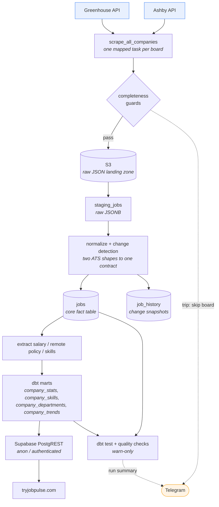

# JobPulse

[](https://github.com/hasiegler/job-posting-pipeline/actions/workflows/tests.yml)

A daily Airflow pipeline that tracks hiring activity across 250+ public company job boards, reconciling two different ATS APIs into one warehouse and modeling it with dbt into daily company-level snapshots. Live at **[tryjobpulse.com](https://tryjobpulse.com)**.

## What it does

A company's job board tells you what is open today and nothing about what changed. Postings disappear silently, and no public dataset records when a role opened, how long it stayed up, or whether a team is actually growing.

This pipeline scrapes every Greenhouse and Ashby board in its registry daily, lands the raw responses in S3, normalizes both ATS shapes into one Postgres schema, and diffs each posting against its previous state to classify it as new, updated, reactivated, unchanged, or closed. Changes are snapshotted into a history table, and dbt rolls the result into per-company daily aggregates the site reads directly.

## Architecture



## How it works

The DAG (`dags/main.py`) runs ten steps daily at 12:00 UTC, one run at a time, with a six-hour timeout.

**Sync and scrape.** `companies.yaml` is the source of truth for which boards are scraped; step 0 pushes it into the `companies` table so config and warehouse can't drift. Each enabled board gets its own mapped task. Both APIs return descriptions in one bulk call — Greenhouse via `content=true`, Ashby via `includeCompensation=true` — so a board costs one HTTP request, not one per posting.

**The S3 landing zone.** Each scrape writes its payload to `s3://{bucket}/{company}/{yyyy}/{mm}/{dd}/{company}_{timestamp}.json` and returns only the path and a few counts as its XCom. Raw ATS objects are stored verbatim in a thin envelope. The next step reads the file back and inserts it into `staging_jobs` as JSONB.

**Normalize and diff.** `process_staging_to_jobs` loads staging rows through the ATS-specific normalizer into a temp table, then does everything else in scraper-agnostic SQL. One join against `jobs` classifies each posting: absent is new, differing is updated, previously inactive is reactivated, and an active job whose company was scraped but which didn't appear is closed. Only nine content fields join the diff, so a re-parsed salary can't masquerade as an employer edit.

**Extract and snapshot.** Salary, remote policy, and skills come out of description text by regex and catalog matching, but structured API values win wherever they exist, so the text parsers are a fallback. Changed jobs are snapshotted into `job_history` by a server-side `INSERT ... SELECT` — Python passes only IDs and change types while Postgres copies the row bodies, keeping large deltas out of worker memory. Processed staging rows are purged.

**Model, test, alert.** Airflow shells out to dbt in an isolated virtualenv to rebuild the marts, runs `dbt test`, and collects warnings. A final task writes per-run metrics, folds those warnings in with its own operational checks, and sends exactly one Telegram message per run.

## Design decisions

### Two ATS integrations, one pipeline

Greenhouse and Ashby agree on almost nothing: Greenhouse returns one `location.name` string and no compensation at all, Ashby returns a primary `location` plus a `secondaryLocations` array and a structured `compensation.summaryComponents` list. The obvious options were a separate pipeline per ATS, or one pipeline littered with `if scraper_type == ...`.

Instead all ATS-specific code sits behind a single dictionary — `NORMALIZERS` in `data_modification.py` — mapping `scraper_type` to a normalizer. Each returns the same field contract, rows land in a shared temp table, and every step after that is SQL with no idea which ATS produced a row. A third ATS costs one function and one dictionary entry.

The price is a lowest-common-denominator schema. The contract carries columns only one source populates — Greenhouse normalizers hard-code `salary_*` to `None` — so genuinely source-specific signal is either dropped or forces a schema change on everything at once.

### Raw payloads land in S3 before the database sees them

Scraped jobs could go straight into staging. Two things argued otherwise.

A parser bug is unrecoverable without the raw response: because S3 keeps every payload verbatim and date-partitioned, a salary-regex fix can be replayed over history rather than waiting for re-scrapes, and postings that have since closed can never be re-fetched at all. It also keeps Airflow's metadata database small — a mapped task returns a path and a few integers instead of a multi-megabyte payload, which is what stops the worker being OOM-killed serializing XComs across hundreds of boards.

The costs are real: an extra network hop and an AWS dependency on the critical path, and a write-once zone that grows forever because nothing prunes it today.

### Aggregations live in dbt, not the ingestion code

The marts began as Python building analytics tables inline during ingestion. Moving them to dbt drew a hard line — Python owns getting correct rows into `jobs`, dbt owns everything derived from them. Declaring `jobs`, `companies`, and `company_run_metrics` as dbt `sources` makes that boundary explicit and buys lineage, tests, and readable compiled SQL.

It also made the logic reviewable. Boilerplate-skill suppression — drop a skill at a company when it appears in over 20 postings *and* at least 90% of its active jobs, because it lives in the "About Us" blurb rather than the requirements — is a `HAVING` clause with thresholds exposed as dbt vars, not a nested loop.

The cost is a second runtime: dbt needs its own virtualenv baked into the image because its dependencies conflict with Airflow's pins, Airflow invokes it by subprocess and parses `run_results.json` to recover results, and stack traces now span two toolchains.

### Airflow rather than cron

For one daily job, cron and a script would be far less machinery. Airflow earned its place on three specifics: dynamic task mapping gives one task instance per board, so failures are attributable to a named company rather than one opaque exit code; `max_active_tis_per_dagrun=4` throttles staging loads independently of the scrape fan-out, which matters because Supabase's session pooler has a hard client limit that unbounded parallelism trips immediately; and retry, timeout, and failure-callback semantics come free per task.

The cost is disproportionate operational weight — a scheduler, webserver, Celery worker, Redis, and metadata Postgres to run one DAG, and much of why `.env` has 25 variables. A managed orchestrator would be a defensible trade.

### Failure detection assumes the scrape will lie

The dangerous failure isn't a board erroring out; it's a board returning `200 OK` with a truncated list. Ingested naively that silently closes hundreds of live postings and corrupts the history table — the one thing here that can't be rebuilt from S3.

So each ATS is guarded on its own terms. Greenhouse publishes `meta.total`, making the check exact: if it disagrees with the array length, refuse the batch. Ashby publishes no equivalent, so it falls back to comparing today's count against that company's last successful run, tripping on a zero-floor or a >50% drop. Both rules require a baseline of at least 10 postings, because a small board legitimately going to zero is normal and must not read as a bad scrape. A trip skips that board only — no S3 write, no staging insert — leaving every other board unaffected. After 7 consecutive HTTP 200s that return 0 jobs, the empty board is treated as real: the 0-job payload goes through, leftover jobs close, and scraping continues. Baseline queries ignore `scraped_jobs = 0` rows, so those zeros never become the new baseline. Separately, permanent HTTP failures (404, 401, 403) wait for the same 7-day streak before flipping `enabled: false` in both `companies.yaml` and the warehouse and closing leftover jobs; anything else is assumed transient.

Alerting is deliberately fail-open: `send_alert` no-ops when the Telegram variables are unset and swallows its own errors, so the alerting path can never fail the pipeline it reports on.

### Data tests warn, they don't block

All 13 dbt tests and the 6 Python checks run at `warn` severity, and their findings are collected rather than raised: a run reports its problems and still completes. Failing the DAG on any violation would strand an entire day's load over a few implausible salaries in one company's data.

The honest cost is that bad rows land in the warehouse and get reported rather than stopped at the door — which works here only because a human reads the summary each morning.

## Scale

Volume figures are a snapshot **measured 2026-09-06** and grow every run; treat them as an order of magnitude, not a live counter. The configuration figures below them are exact and only change when the code does.

<!-- Maintenance: the Volume table is generated. To refresh it, run
     `set -a && source .env && set +a && python tools/analysis/readme_stats.py`
     and paste its output over the table below. The Configuration table is
     derived from code, not data — update it only when you change the code
     (e.g. adding boards to companies.yaml or skills to seed_skills.py). -->


| Volume (as of 2026-09-06) | |
|---|---|
| Postings tracked | 53,667 total, 26,052 currently active |
| Change history | 145,802 events over 101 consecutive days — 53,667 opens, 31,851 closes |
| Daily throughput | ~25,700 postings re-checked per run; ~600 opened, ~350 closed |
| Run duration | 28 min median, 49 min worst, over 112 runs — against a 6-hour timeout |
| Extraction coverage | 63% salary, 67% remote policy, 65% skills, of active postings |
| Mart size | 18,301 company-day snapshots, 645,373 skill rows, 361,341 department rows |

| Configuration | |
|---|---|
| Boards scraped daily | 252 — 115 Greenhouse, 137 Ashby (257 registered, 5 disabled) |
| Skills taxonomy | 190 distinct skills, 11 categories, 46 alias groups |
| Warehouse | 10 Postgres tables + 4 dbt marts |
| Data tests | 13 dbt tests + 6 Python operational checks |
| Schedule | Daily at 12:00 UTC, one run at a time, 6-hour timeout |
| Staging concurrency | 4 concurrent loads (Supabase session-pooler limit) |
| DB resilience | 5 connection attempts, exponential backoff 2s → 16s |

## Stack

| Component | Technology | Purpose |
|---|---|---|
| Orchestration | Airflow 2.9.2 (Celery executor) | Schedules the DAG, one mapped task per board |
| Ingestion | Python, `requests` | Greenhouse and Ashby public posting APIs |
| Raw storage | AWS S3 | Immutable landing zone, partitioned by company and date |
| Warehouse | Supabase Postgres | Staging, core `jobs`/`job_history`, marts, monitoring |
| Transformation | dbt-core 1.12, dbt-postgres 1.11 | Daily snapshot marts, 13 data tests |
| Extraction | Regex + catalog matching | Salary, remote policy, skills from description text |
| Serving | Supabase PostgREST | `company_trends` view granted to `anon`/`authenticated` |
| Alerting | Telegram Bot API | One summary per run, plus guard trips and task failures |
| Local runtime | Docker Compose | Airflow, Celery worker, Redis, metadata Postgres |
| CI | GitHub Actions | Compiles every module, runs the unit tests |

## Repo layout

```
dags/                      # The pipeline. Everything here runs in production.
├── main.py                #   DAG definition — the ten steps, wired
├── alerting.py            #   Telegram; fails open, never breaks a run
├── api/                   #   Per-ATS scrapers + completeness guards
├── datawarehouse/         #   Loading, normalization, change detection, QC, dbt runner
│   └── init_db.py         #   One-time schema bootstrap
└── extraction/            #   Salary / remote-policy / skills parsers
dbt/                       # Transformation layer
├── models/marts/          #   4 marts: 3 incremental snapshot tables + 1 view
├── models/sources.yml     #   Declares the Python-owned tables dbt may read
└── tests/                 #   11 singular data tests (warn severity)
tests/                     # Unit tests — no DB, no network
companies.yaml             # Source of truth: which boards get scraped
docker-compose.yaml        # Airflow + Celery + Redis + metadata Postgres
tools/                     # NOT part of the pipeline — see below
├── analysis/              #   Read-only exploratory queries, run by hand
└── validators/            #   Vet new job boards before adding them
```

`tools/` is local-only. Nothing in it is imported by the DAG, scheduled, or shipped in the image — it is the first exclusion in `.dockerignore`, and its database connections are opened read-only at the server level. It is the workbench around the pipeline, not part of it.

## Running locally

Requires Docker and a Postgres database (the pipeline targets Supabase).

```bash
cp .env.example .env        # fill in Supabase, AWS, and Airflow secrets
docker compose up -d        # Airflow webserver, scheduler, worker, Redis, metadata DB
```

`.env.example` documents all 25 variables; the non-secret defaults work as-is and it includes the commands to generate the Fernet and webserver keys. Telegram may be left blank — alerting no-ops without it.

Bootstrap the warehouse once, then open the Airflow UI at `localhost:8080` and unpause `company_json_scraper` (it is created paused):

```bash
PYTHONPATH=dags python dags/datawarehouse/init_db.py      # create the 10 tables
PYTHONPATH=dags python dags/datawarehouse/seed_skills.py  # seed the skills taxonomy
```

Unit tests need no dependencies or database:

```bash
PYTHONPATH=dags python -m unittest discover -s tests
```

## Limitations and next steps

**Transient failures wait a full day.** Airflow task retries are commented out in `default_args`, so a board failing on a network blip is skipped until tomorrow. The completeness guards make skipping safe, which is exactly why the gap was easy to leave open. Enabling retries with backoff is the obvious fix and isn't done.

**History misses extraction-only changes.** `job_history` rows come from the staging diff, which compares content fields only. If a skills regex improves and re-tags an untouched posting, the new value overwrites the old with no history row. The table tracks what employers changed, not what the pipeline learned — a distinction the schema doesn't surface.

**Salary coverage is structurally uneven.** Ashby publishes structured compensation, Greenhouse publishes none, so Greenhouse salaries rest entirely on a regex over prose. Roughly a third of active postings still yield no salary at all, and the cross-ATS aggregates that do exist compare a parsed number against a published one without any provenance flag distinguishing them.

**It runs on one machine.** Docker Compose on a single host: no managed scheduler, no CD, and infrastructure that exists only as a compose file. The unit tests cover the skills self-vendor logic and nothing else — the SQL-heavy transformation core, where the real complexity lives, is verified by dbt tests against production data rather than fixtures in CI.
